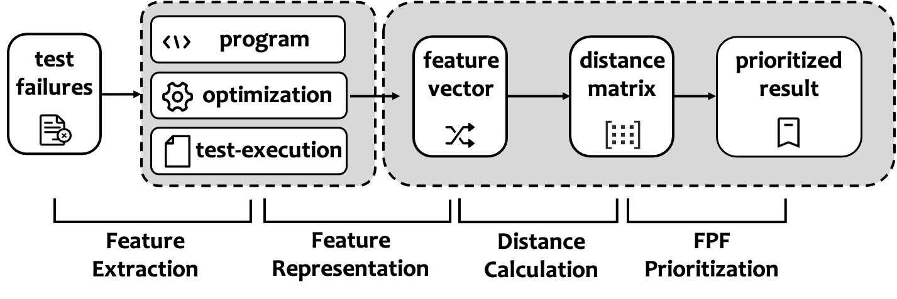
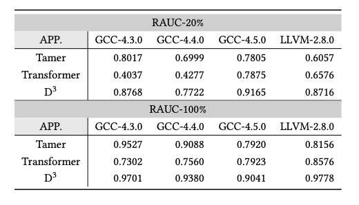

# Silent Compiler Bug De-duplication via Three-Dimensional Analysis

Welcome to the homepage of $D^3$! This the implementation of our research "Silent Compiler Bug De-duplication via Three-Dimensional Analysis".

## Introduction

Compiler testing is an important task for assuring the quality of compilers, but investigating test failures is very time-consuming. This is because many test failures are caused by the same compiler bug (known as bug duplication problem). In this work, we propose a novel technique (called $D^3$) to solve the duplication problem on silent compiler bugs. Its key insight is to characterize the silent bugs from the testing process and identify three-dimensional information (i.e., test program, optimizations, and test execution) for bug de-duplication.

Figure 1 presents the workflow of $D^3$. Specifically, for a silent bug (denoted as b), $D^3$ considers three-dimensional information to depict the test failure, i.e., test program (denoted as p), optimizations (denoted as o), and test execution (denoted as c). Then, $D^3$ measures the distance among test failures based on the three-dimensional information for silent bug de-duplication.



<p align="center">Figure 1: Overview of D3</p>

To evaluate the effectiveness of $D^3$, we conducted an empirical study based on four released datasets, which contain 2,024 test failures caused by 62 uniques bugs from four versions of GCC and LLVM. Our results show that $D^3$ significantly outperforms the two state-of-the-art compiler bug de-duplication techniques (called Tamer and Transformer in our work). Table 1 shows the overall experimental results.

<p align="center">Table 1: Overall experimental results</p>

<div align=center></div>

## Getting Started

> The failing test programs and their coverage can be downloaded from the [link](https://drive.google.com/file/d/1R20coo1SdnOBminAIYjgJ5ZvrRiuUiBd/view?usp=share_link), the coverage data of test suites (used in the execution feature extraction) is in the `passing testsuite coverage` folder, the generated passing programs and the corresponding differences extracted from pairs of failing program and passing programs (used in the program feature extraction) can be downloaded from this [link](https://drive.google.com/file/d/1o8wfIQdsUvrt73oWdnlud1Hy4zKQ1-Qo/view?usp=share_link)

### Use pre-calculated distances

If you don't want to process the row data by youself, we provide the pre-calculated distances in folder `distances`.

**Unzip the [data.zip](https://drive.google.com/file/d/1R20coo1SdnOBminAIYjgJ5ZvrRiuUiBd/view?usp=share_link) under your project directory first**, then just run the following command to get the result, which will be saved in the `results` folder.

```
python test.py --dataset llvm280 --loop_time 100
```

Note that `--dataset` indicates which data set to test on. The options are 'gcc430', 'gcc440', 'gcc450', and 'llvm280'. `--loop_time` indicates the number of times the test is repeated, and the results are averaged. We recommend at least 100 times to avoid random factors. 


### Process the row data on your own

Here we take the data processing of llvm-2.8.0 as an example.

First download the [generated passing programs and the differences](https://drive.google.com/file/d/1o8wfIQdsUvrt73oWdnlud1Hy4zKQ1-Qo/view?usp=share_link) and unzip it, then place it in the `mutation-data` folder.

To get the three features, namely program features, optimization features, and exexcution features, just run the following three commands.

```python
# Program features
python get-program-features.py
# Optimization features
python get-optimization-features.py
# Execution features
python get-execution-features.py
```

The required configuration for each feature is in the header of the file, such as `get-execution-features.py`.  The first few lines of the file look like this:

```python
names = './data/llvm280/names'
wrongat = './data/llvm280/wrongat-new'
cov_prefix = './data/llvm280/'
ep_file = './passing-testsuite-coverage/testsuite_280_ep.txt'
np_file = './passing-testsuite-coverage/testsuite_280_np.txt'
dis_url = './coverage.npy'
```

If you want to extend to other data sets, you only need to modify the path here (the required files are provided in our data).


## Directory description

```
├── distances                   	:  the calculated distances
├── figures                     	:  figures in the README.md
├── passing-testsuite-coverage  	:  preprocessed coverage information of testsuites
├── results                     	:  testing results
├── Config.py                   	:  Configurations and dataset descriptions
├── get-execution-features.py   	:  get execution features and save the distance 
├── get-program-features.py       :  get program features and save the distance 
├── get-optimization-features.py  :  get optimization features and save the distance 
└── test.py												:  use the calculated distances to reproduce the results
```

